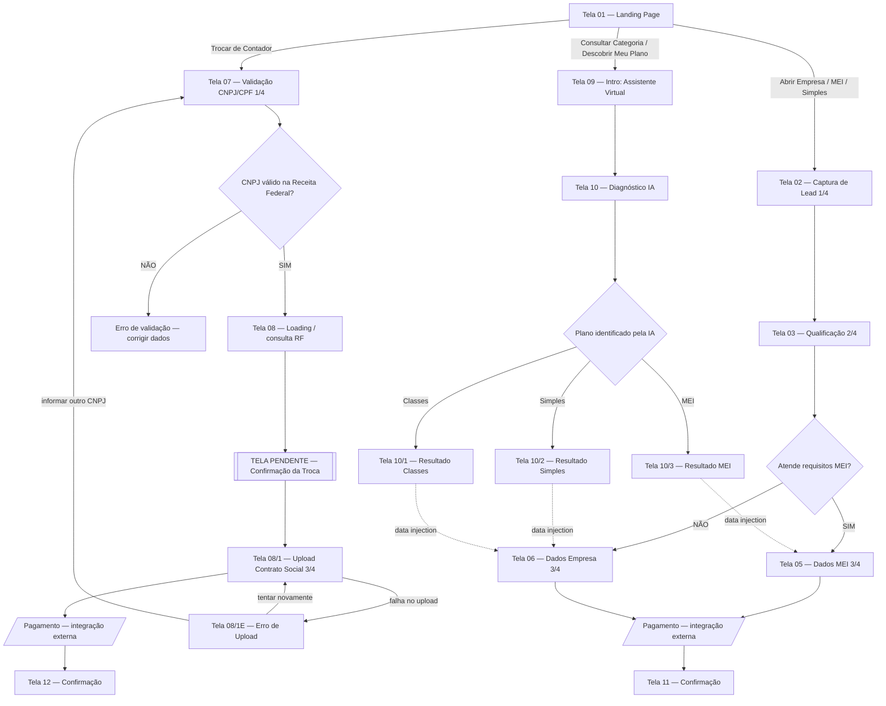

# Contabinex — Mapa de Fluxo

Documento de referência do produto. Descreve as telas, os três funis de conversão, os pontos de decisão e as integrações externas.

> **Escopo deste doc:** navegação, dados coletados por tela e regras de roteamento. Não define visual, copy final nem contratos de API — apenas o que já está fechado no mapa de fluxo.

---

## 1. Visão geral

O app tem **3 funis de conversão**, todos partindo da mesma Landing Page (Tela 01). O que muda é o CTA clicado:

| Funil | Entrada (CTA na Tela 01) | Objetivo |
|---|---|---|
| **A — Nova Abertura** | "Abrir uma Empresa", "Ativar MEI", "Selecionar Simples", rodapé "Abrir Empresa" | Abrir empresa nova (MEI, Simples Nacional ou Classes Profissionais) |
| **B — Troca de Contador** | "Trocar de Contador", rodapé "Trocar de Contador" | Migrar empresa já existente para a Contabinex |
| **C — Triagem com IA** | "Consultar Categoria", "Descobrir Meu Plano" | Usuário não sabe o que precisa → IA diagnostica e joga ele no funil certo |

O Funil C **não é um funil terminal**: ele classifica o usuário e faz *data injection* nos funis A ou B, reaproveitando o que já foi respondido.

### Tipos de nó (legenda do mapa)

| Tipo | Significado |
|---|---|
| Tela / Etapa | Tela navegável |
| Decisão / Triagem | Ponto de branching (regra de negócio ou IA) |
| Sucesso / Endpoint | Fim de fluxo controlado pelo app |
| Alerta / Sub-caso | Tela pendente ou caminho secundário |
| Erro / Falha | Estado de erro com ação de recuperação |

---

## 2. Diagrama

---

## 3. Funil A — Nova Abertura

Fluxo de 4 passos com indicador de progresso (`1/4` … `4/4`).

### Tela 01 — Landing Page
Ponto de entrada comum. CTAs que abrem este funil:
- Abrir uma Empresa
- Ativar MEI
- Selecionar Simples
- Rodapé: Abrir Empresa

### Tela 02 — Captura de Lead `1/4`
Campos:
- Nome
- E-mail
- Celular

> Primeira captura de lead do app. Persistir mesmo se o usuário abandonar nas telas seguintes.

### Tela 03 — Qualificação `2/4`
Campos:
- Faturamento
- Nº de funcionários
- Ramo de atividade

Alimenta diretamente a decisão seguinte.

### Decisão — Atende requisitos MEI?

Regras de roteamento derivadas da qualificação:

- **Tela 04A** — Faturamento / nº de funcionários fora do limite → **Simples Nacional**
- **Tela 04B** — Atividade regulamentada → **Classes Profissionais**

| Resultado | Próxima tela |
|---|---|
| SIM (elegível a MEI) | Tela 05 — Dados MEI |
| NÃO | Tela 06 — Dados Empresa |

### Tela 05 — Dados MEI `3/4`
Campos:
- Nome Fantasia
- Endereço

### Tela 06 — Dados Empresa `3/4`
Campos:
- Nome Fantasia
- Atividade
- Sócios

### Pagamento (externo) → Tela 11 — Confirmação
Ver seção **5. Integrações externas**.

---

## 4. Funil B — Troca de Contador

### Tela 01 — Landing Page
CTAs: "Trocar de Contador" (principal e rodapé).

### Tela 07 — Validação CNPJ/CPF `1/4`
Integração: **API Receita Federal**.

Campos:
- CNPJ
- CPF do Sócio Administrador

### Decisão — CNPJ válido na Receita Federal?

| Resultado | Comportamento |
|---|---|
| SIM | Segue para Tela 08 (Loading) |
| NÃO | Volta para Tela 07 com estado de erro (dados inválidos / não encontrados) |

### Tela 08 — Loading
Estado de espera enquanto consulta a Receita Federal.
Copy de referência: *"Conectando à Receita Federal…"*

Os dados retornados pela RF alimentam as telas seguintes (**data injection**) — razão social, atividade, sócios etc.

### ⚠️ TELA PENDENTE — Confirmação da Troca
**Ainda não existe. Precisa ser criada.**
Objetivo: confirmação explícita do usuário — *"Quer mesmo trocar de contador?"*
Ponto de fricção intencional antes do upload de documentos.

### Tela 08/1 — Upload Contrato Social `3/4`
Upload do contrato social da empresa.

### Tela 08/1E — Erro: Falha no Upload
Estado de erro com duas ações de recuperação:
- **Tentar novamente** → volta para Tela 08/1
- **Informar outro CNPJ** → volta para Tela 07

### Pagamento (externo) → Tela 12 — Confirmação

---

## 5. Funil C — Triagem com IA

Para o usuário que ainda não sabe qual regime/plano precisa.

### Tela 01 — Landing Page
CTAs: "Consultar Categoria", "Descobrir Meu Plano".

### Tela 09 — Intro: Assistente Virtual
- Card de boas-vindas
- CTA: "Vamos Começar"

### Tela 10 — Diagnóstico IA
- **4 perguntas consultivas** ao usuário
- **Mapeamento em segundo plano**: enquanto o usuário responde, a IA já classifica — a classificação não é uma etapa visível separada

### Decisão — Plano identificado pela IA

Três saídas possíveis, cada uma com sua tela de resultado:

| Classificação | Tela de resultado | Data injection para |
|---|---|---|
| MEI | Tela 10/3 — MEI | Tela 05 (Dados MEI) |
| Simples | Tela 10/2 — Simples | Tela 06 (Dados Empresa) |
| Classes | Tela 10/1 — Classes | Tela 06 (Dados Empresa) |

> **Importante:** o resultado do diagnóstico deve ser propagado para o funil de destino. O usuário não pode ser obrigado a repetir informações que já deu na Tela 10.

---

## 6. Integrações externas

### Pagamento
> **OBSERVAÇÃO (do mapa original):** as telas de pagamento serão integradas por **outro desenvolvedor**, a partir das telas **05**, **06** e **08/1**. O fluxo externo de confirmação de pagamento retorna para as telas de conclusão (**11** e **12**).

Implicações práticas:
- Telas 05, 06 e 08/1 são os **pontos de saída** do fluxo controlado pelo app.
- É preciso um contrato de handoff: o que o app entrega ao módulo de pagamento e o que ele devolve.
- É preciso um callback/deeplink de retorno que caia em Tela 11 (funil A) ou Tela 12 (funil B).
- Tratar o caso de **pagamento não concluído / abandonado**: não está mapeado e provavelmente precisa de um estado.

### Receita Federal
- Consumida na **Tela 07** (validação de CNPJ + CPF do sócio administrador).
- A **Tela 08** é o estado de loading dessa consulta.
- Resposta injetada nas telas seguintes do funil B.

---

## 7. Inventário de telas

| ID | Nome | Funil | Status |
|---|---|---|---|
| 01 | Landing Page | A / B / C | Definida |
| 02 | Captura de Lead `1/4` | A | Definida |
| 03 | Qualificação `2/4` | A | Definida |
| 04A | Roteamento Simples Nacional | A | Regra de decisão |
| 04B | Roteamento Classes Profissionais | A | Regra de decisão |
| 05 | Dados MEI `3/4` | A | Definida — saída p/ pagamento |
| 06 | Dados Empresa `3/4` | A | Definida — saída p/ pagamento |
| 07 | Validação CNPJ/CPF `1/4` | B | Definida |
| 08 | Loading — Receita Federal | B | Definida |
| — | Confirmação da Troca | B | **PENDENTE — criar** |
| 08/1 | Upload Contrato Social `3/4` | B | Definida — saída p/ pagamento |
| 08/1E | Erro: Falha no Upload | B | Definida |
| 09 | Intro: Assistente Virtual | C | Definida |
| 10 | Diagnóstico IA | C | Definida |
| 10/1 | Resultado — Classes | C | Definida |
| 10/2 | Resultado — Simples | C | Definida |
| 10/3 | Resultado — MEI | C | Definida |
| 11 | Confirmação | A | Definida — retorno do pagamento |
| 12 | Confirmação | B | Definida — retorno do pagamento |

---

## 8. Pontos em aberto

1. **Tela de Confirmação da Troca** (funil B) não existe — precisa ser desenhada e implementada.
2. **Contrato de handoff do pagamento** com o outro dev: payload de ida, callback de volta, tratamento de falha/abandono.
3. **Persistência entre funis**: onde vive o estado do lead quando o usuário vem do funil C para o A/B.
4. **Estados de erro genéricos**: só o erro de upload (08/1E) e o de CNPJ inválido estão mapeados. Falta timeout da Receita Federal, falha de rede e erro do serviço de IA.
5. **Numeração de progresso**: o mapa mostra `1/4`, `2/4`, `3/4` — a etapa `4/4` presumivelmente é o pagamento, que é externo. Confirmar como exibir.