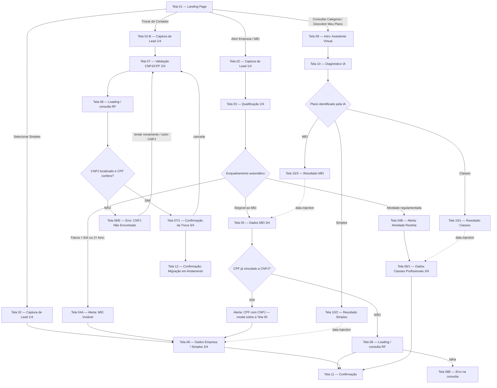

# Contabinex — Mapa de Fluxo

Documento de referência do produto. Descreve as telas, os três funis de conversão, os pontos de decisão e as integrações externas.

> **Escopo deste doc:** navegação, dados coletados por tela e regras de roteamento. Não define visual, copy final nem contratos de API — apenas o que já está fechado no mapa de fluxo.
>
> **Revisão de 31/08/2026** — incorpora os *Roteiros de Requisitos* enviados pelo cliente (fluxos MEI, Simples Nacional, Classes Profissionais e Troca de Contador). Mudanças em relação à versão anterior estão marcadas com 🔄.

---

## 1. Visão geral

O app tem **3 funis de conversão**, todos partindo da mesma Landing Page (Tela 01). O que muda é o CTA clicado:

| Funil | Entrada (CTA na Tela 01) | Objetivo |
|---|---|---|
| **A — Nova Abertura** | "Abrir uma Empresa", "Ativar MEI", "Selecionar Simples", rodapé "Abrir Empresa" | Abrir empresa nova (MEI, Simples Nacional ou Classes Profissionais) |
| **B — Troca de Contador** | "Trocar de Contador", rodapé "Trocar de Contador" | Migrar empresa já existente para a Contabinex |
| **C — Triagem com IA** | "Consultar Categoria", "Descobrir Meu Plano" | Usuário não sabe o que precisa → IA diagnostica e joga ele no funil certo |

O Funil C **não é um funil terminal**: ele classifica o usuário e faz *data injection* nos funis A ou B, reaproveitando o que já foi respondido.

🔄 **Escolha direta do plano na landing.** Quando o usuário seleciona um plano específico
no card de planos, ele passa pela captura de lead e vai **direto** ao formulário daquele
plano, **sem** passar pela qualificação nem pelos alertas 04A/04B:

| CTA da landing | Rota | Destino |
|---|---|---|
| Selecionar Simples Nacional | `#/abrir-empresa/simples` | Tela 02 → Tela 06 |
| (reservado) Classes Profissionais | `#/abrir-empresa/classes` | Tela 02 → Tela 06/1 |

> "Consultar Minha Categoria" (card de Classes) continua abrindo o **Funil C**, coerente
> com o rótulo do botão. A rota `#/abrir-empresa/classes` já existe para quando houver um
> CTA de seleção direta desse plano.

### Tipos de nó (legenda do mapa)

| Tipo | Significado |
|---|---|
| Tela / Etapa | Tela navegável |
| Decisão / Triagem | Ponto de branching (regra de negócio ou IA) |
| Sucesso / Endpoint | Fim de fluxo controlado pelo app |
| Alerta / Sub-caso | Desvio condicional (modal ou tela) |
| Erro / Falha | Estado de erro com ação de recuperação |

---

## 2. Diagrama

---

## 3. Funil A — Nova Abertura

Fluxo de 4 passos com indicador de progresso (`1/4` … `4/4`). A etapa `4/4` é o pagamento (externo).

### Tela 01 — Landing Page
Ponto de entrada comum. CTAs que abrem este funil:
- Abrir uma Empresa · Ativar MEI · Selecionar Simples · Rodapé: Abrir Empresa

### Tela 02 — Captura de Lead `1/4`
Campos: Nome completo · E-mail · Celular (máscara com DDD).

> Primeira captura de lead do app. Persistir mesmo se o usuário abandonar nas telas seguintes.

### Tela 03 — Qualificação `2/4`
Campos:
1. Faturamento — *Até R$ 81.000,00/ano* | *Acima de R$ 81.000,00/ano*
2. Nº de funcionários — *Nenhum ou no máximo 1* | *2 ou mais*
3. Ramo de atividade — busca com auto-complete na base CNAE (`app/src/data/cnae.js`)

### 🔄 Decisão — Enquadramento automático

Ordem de avaliação (a **atividade regulamentada tem prioridade** sobre faturamento e funcionários):

| Condição | Resultado | Próxima tela |
|---|---|---|
| Atividade regulamentada por conselho de classe | Classes Profissionais | **Tela 04B** → Tela 06/1 |
| Faturamento > R$ 81 mil/ano **ou** 2+ funcionários | Simples Nacional | **Tela 04A** → Tela 06 |
| Atividade não permitida ao MEI por outro motivo | Simples Nacional | **Tela 04A** → Tela 06 |
| Demais casos | MEI | **Tela 05** |

A decisão vive em `enquadrar()` (`funnels/nova-abertura/qualificacao/index.jsx`) e a base de
atividades — com o conselho de cada profissão regulamentada — em `data/cnae.js`.

### Tela 04A — Alerta: Enquadramento MEI Inviável
Modal sobre a Tela 03 esmaecida. Ações: *Continuar para Simples Nacional* → Tela 06 ·
*Voltar e corrigir meus dados* → Tela 03. Não aparece para quem escolheu o plano na landing.

### Tela 04B — Alerta: Atividade Restrita no MEI
Mesma mecânica. Ações: *Continuar para Classes Profissionais* → Tela 06/1 · *Voltar e corrigir meus dados*.
O conselho identificado no CNAE é injetado na Tela 06/1 (o usuário não escolhe duas vezes).

### 🔄 Tela 05 — Dados MEI `3/4`
Campos: CPF (validação por dígitos verificadores + consulta à RF) · Nome Fantasia (opcional) ·
Atividade principal (CNAE) e secundárias · CEP (ViaCEP) · Endereço · Cidade · Estado · País ·
Forma de atuação.

**Desvio — CPF vinculado a CNPJ existente:** ao completar o CPF, se a RF apontar CNPJ ativo,
abre modal sobre a Tela 05 com *Ir para plano Simples Nacional* (→ Tela 06, preservando o que
já foi preenchido) ou *Voltar e corrigir meus dados* (fecha o modal). Não se aplica a quem já
está no Simples Nacional.

`Avançar` → **Tela 08 (loading)** → Tela 11.

### 🔄 Tela 06 — Dados Empresa / Simples Nacional `3/4`
Origens: Tela 04A · modal de CPF da Tela 05 · escolha direta na landing.

- **Seção A — Dados da empresa e atividade:** CPF · **Razão Social** (exclusiva deste plano) ·
  Nome Fantasia · CNAE principal e secundárias · CEP/Endereço/Cidade/Estado/País · Forma de atuação.
- **Seção B — Estrutura societária:** *único titular (SLU)* ou *com sócios*. Por sócio: nome, CPF,
  participação (%) e e-mail. A soma das participações precisa dar **exatamente 100%**.
- **Seção C — Informações operacionais:** pró-labore (1 salário mínimo / acima / sem retirada) e
  previsão de contratação CLT (não contratar / 1 a 3 / mais de 3).

### 🔄 Tela 06/1 — Dados Classes Profissionais `3/4`
Origens: Tela 04B · resultado do quiz (Tela 10/1) · escolha direta na landing.

- **Seção A — Identificação da categoria:** conselho de classe (lista fixa em `data/conselhos.js`,
  com busca) e registro profissional (opcional). O conselho vem pré-selecionado quando a atividade
  foi escolhida na Tela 03.
- **Seção B — Dados de constituição:** Nome Fantasia (opcional) · CEP/Endereço/Cidade/Estado/País.
  O endereço é o **local de exercício da profissão** (viabilidade urbana).
- **Seção C — Estrutura societária:** igual à Tela 06, com o aviso de que todos os sócios precisam
  ter habilitação no mesmo conselho.
- **Não tem** a seção de informações operacionais (pró-labore / CLT).

### 🔄 Tela 08 — Loading / consulta Receita Federal (Funil A)
Estado de espera após a Tela 05. Falha → **Tela 08E** (tentar novamente / voltar ao início).

### 🔄 Tela 11 — Confirmação
"Sua Jornada Começou!" + bloco *O que acontece agora?* (revisão técnica, contato em até 48h úteis,
acesso ao painel). Ações: *Voltar ao Início* · *Conhecer o Painel*.

> Os documentos (contrato social, comprovante de endereço) são pedidos **depois**, dentro da
> plataforma, após adesão e pagamento.

---

## 4. Funil B — Troca de Contador

### 🔄 Tela 02-B — Captura de Lead `1/4`
Entrada do funil (`#/trocar-contador`). Mesmos campos da Tela 02, com título e contexto próprios
("Vamos iniciar a sua troca de contador") — funil de marketing distinto para métricas.

### Tela 07 — Validação CNPJ/CPF `2/4`
Campos: CNPJ da empresa (máscara + dígitos verificadores) e CPF do sócio administrador.
Regra de segurança: o CPF precisa ser de um sócio/responsável legal do CNPJ.
Ação: *[ Validar Empresa ]* → Tela 08.

### Tela 08 — Loading / consulta Receita Federal
Copy: *"Conectando à Receita Federal e validando dados cadastrais... Por favor, não feche esta página."*
Os dados retornados alimentam a Tela 07/1 (**data injection**).

| Resultado | Destino |
|---|---|
| CNPJ localizado + CPF confere | Tela 07/1 |
| CNPJ não encontrado · timeout · CPF divergente | Tela 08/E |

### Tela 08/E — Erro: CNPJ Não Encontrado
Ações: *Tentar Novamente* (volta à Tela 07 com os dados) · *Informar outro CNPJ* (limpa os campos) ·
*Falar com consultor*.

### 🔄 Tela 07/1 — Confirmação da Troca `3/4`
Exibe, em leitura, os dados vindos da RF: Razão Social · CNPJ · Endereço · **Situação Cadastral**
(badge). Situação diferente de `ATIVA` **bloqueia o avanço** e orienta a procurar o suporte.

Bloco **Termo de Autorização** — ao confirmar, o usuário autoriza a Contabinex a iniciar a migração,
solicitar a transferência de responsabilidade na RF e contatar o contador anterior.
O aceite tem valor jurídico: o backend deve registrar **data/hora e IP**.

Ações: *Confirmar Troca de Contador* → Tela 12 · *Cancelar* → Tela 07.

### 🔄 Tela 12 — Confirmação
"Migração em Andamento" + *Próximas etapas* (contato com o contador anterior, validação do histórico
fiscal, guia de boas-vindas). Ações: *Ir para o Dashboard* · *Falar com Especialista*.

### 🔄 Upload de Contrato Social — fora do caminho principal
As telas 08/1 (upload) e 08/1E (erro de upload) **saíram do fluxo principal**: os documentos passam a
ser pedidos dentro da plataforma, após a adesão. As telas continuam no código e acessíveis por URL
(`#/trocar-contador/upload`, `#/trocar-contador/erro-upload`) até o dono confirmar a remoção.

---

## 5. Funil C — Triagem com IA

Para o usuário que ainda não sabe qual regime/plano precisa.

### Tela 09 — Intro: Assistente Virtual
Card de boas-vindas + CTA "Vamos Começar".

### Tela 10 — Diagnóstico IA
4 perguntas consultivas; a classificação acontece em segundo plano.

### Decisão — Plano identificado pela IA

| Classificação | Tela de resultado | Data injection para |
|---|---|---|
| MEI | Tela 10/3 — MEI | Tela 05 (Dados MEI) |
| Simples | Tela 10/2 — Simples | Tela 06 (Dados Empresa) |
| Classes | Tela 10/1 — Classes | Tela 06/1 (Dados Classes) |

> **Importante:** o resultado do diagnóstico é propagado para o funil de destino
> (`planoSugerido` + `origemPlano: 'quiz'`). O usuário não repete o que já respondeu.

---

## 6. Integrações externas

### Pagamento
> **OBSERVAÇÃO (do mapa original):** as telas de pagamento serão integradas por **outro desenvolvedor**,
> a partir das telas **05**, **06** e **06/1**. O fluxo externo de confirmação retorna para as telas de
> conclusão (**11** e **12**).

Implicações práticas:
- Telas 05, 06 e 06/1 são os **pontos de saída** do fluxo controlado pelo app.
- É preciso um contrato de handoff: o que o app entrega e o que o módulo de pagamento devolve.
- É preciso um callback/deeplink de retorno que caia em Tela 11 (funil A) ou Tela 12 (funil B).
- Tratar **pagamento não concluído / abandonado** — ainda não mapeado.

### Receita Federal — `app/src/services/receita.js` (**stub**)
- `consultarCpf(cpf)` — Tela 05: o CPF já tem CNPJ vinculado?
- `consultarCnpj(cnpj, cpfSocio)` — Telas 07/08: localiza a empresa e confere o sócio.
- Enquanto não há backend, as respostas são simuladas. Dados de teste:
  - CPF `111.444.777-35` → responde "já possui CNPJ" (abre o modal da Tela 05).
  - CNPJ válido começando por `00` → responde "não encontrado" (leva à Tela 08/E).

### CEP — `app/src/services/viacep.js`
`https://viacep.com.br/ws/{CEP}/json/`. Preenche logradouro, bairro, cidade e estado nas Telas 05, 06 e 06/1.
Erro/CEP inexistente → aviso inline, com preenchimento manual liberado.

### CNAE — `app/src/data/cnae.js`
Recorte local curado (inclui todas as profissões regulamentadas e o conselho de cada uma).
A base completa do IBGE/Receita deve vir do backend quando existir o contrato.

---

## 7. Inventário de telas

| ID | Nome | Rota | Funil | Status |
|---|---|---|---|---|
| 01 | Landing Page | `#/` | A / B / C | Definida |
| 02 | Captura de Lead `1/4` | `#/abrir-empresa` | A | Definida |
| 02 | Captura de Lead — Simples direto | `#/abrir-empresa/simples` | A | 🔄 Nova |
| 02 | Captura de Lead — Classes direto | `#/abrir-empresa/classes` | A | 🔄 Nova (sem CTA na landing ainda) |
| 03 | Qualificação `2/4` | `#/abrir-empresa/qualificacao` | A | 🔄 Enquadramento automático |
| 04A | Alerta: MEI Inviável | `#/abrir-empresa/alerta-simples` | A | Definida |
| 04B | Alerta: Atividade Restrita | `#/abrir-empresa/alerta-classes` | A | Definida |
| 05 | Dados MEI `3/4` | `#/abrir-empresa/dados-mei` | A | 🔄 Formulário completo + modal de CPF |
| 06 | Dados Empresa / Simples `3/4` | `#/abrir-empresa/dados-empresa` | A | 🔄 Três seções |
| 06/1 | Dados Classes Profissionais `3/4` | `#/abrir-empresa/dados-classes` | A | 🔄 Três seções |
| 08 | Loading — Receita Federal | `#/abrir-empresa/processando` | A | 🔄 Nova |
| 08E | Erro na consulta | `#/abrir-empresa/erro` | A | 🔄 Nova |
| 11 | Confirmação | `#/abrir-empresa/confirmacao` | A | 🔄 Copy nova |
| 02-B | Captura de Lead `1/4` | `#/trocar-contador` | B | 🔄 Nova |
| 07 | Validação CNPJ/CPF `2/4` | `#/trocar-contador/validacao` | B | 🔄 Rota e passo mudaram |
| 08 | Loading — Receita Federal | `#/trocar-contador/consultando` | B | Definida |
| 08/E | Erro: CNPJ Não Encontrado | `#/trocar-contador/erro-cnpj` | B | 🔄 Três ações |
| 07/1 | Confirmação da Troca `3/4` | `#/trocar-contador/confirmar-troca` | B | 🔄 Dados da RF + termo |
| 08/1 | Upload Contrato Social | `#/trocar-contador/upload` | B | 🔄 Fora do fluxo principal |
| 08/1E | Erro: Falha no Upload | `#/trocar-contador/erro-upload` | B | 🔄 Fora do fluxo principal |
| 12 | Confirmação | `#/trocar-contador/confirmacao` | B | 🔄 Copy nova |
| 09 | Intro: Assistente Virtual | `#/descobrir-plano` | C | Definida |
| 10 | Diagnóstico IA | `#/descobrir-plano/diagnostico` | C | Definida |
| 10/1 | Resultado — Classes | `#/descobrir-plano/resultado-classes` | C | Definida |
| 10/2 | Resultado — Simples | `#/descobrir-plano/resultado-simples` | C | Definida |
| 10/3 | Resultado — MEI | `#/descobrir-plano/resultado-mei` | C | Definida |

---

## 8. Pontos em aberto

1. **URL do painel/dashboard do cliente.** Os CTAs "Conhecer o Painel" (Tela 11) e "Ir para o
   Dashboard" (Tela 12) hoje voltam para a landing — trocar quando a plataforma existir.
2. **Contrato de handoff do pagamento** com o outro dev: payload de ida, callback de volta,
   tratamento de falha/abandono.
3. **Backend da Receita Federal.** `services/receita.js` é stub; falta endpoint, timeout real
   (10s previstos no roteiro) e a conferência de que o CPF é sócio do CNPJ.
4. **Base CNAE completa.** Hoje é um recorte local; a lista oficial de CNAEs vetados ao MEI precisa
   ser mantida pelo time de produto e validada com a Receita Federal.
5. **Registro do aceite** da Tela 07/1 (data/hora + IP) e follow-up comercial após 3 falhas na Tela 08/E.
6. **Persistência entre sessões.** O estado do funil vive em memória (`FunnelState`); se o usuário
   recarregar a página, perde o preenchimento.
7. **Remoção das telas de upload** do Funil B — aguardando confirmação do dono.
